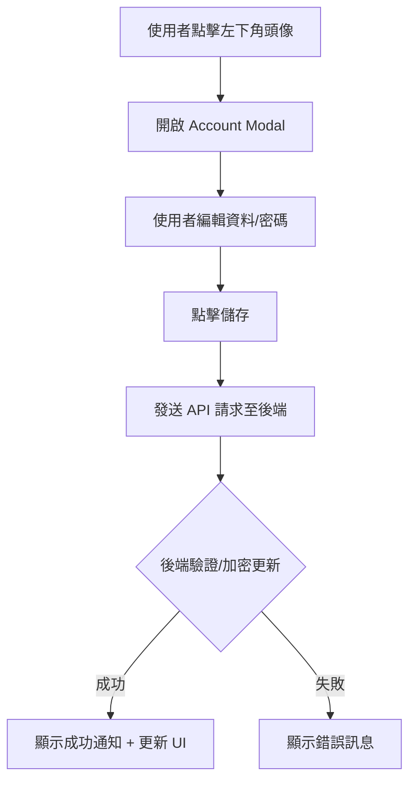

# 帳號系統設計思路 (Account System)

雖然是本地應用程式，但具備個人化設定能大幅提升專業感。

## 1. 設定入口 (Entry Point)
- 位於全域導航列的最下方，顯示目前的頭像（圓圈）。
- 按下後，在原地或螢幕中央彈出一個精緻的小視窗。

## 2. 功能範圍 (Features)
- **個人資料：** 帳號名稱、更換頭像。
- **安全性：** 密碼設置（用於本地保護資料隱私）。
- **聯絡資訊：** Gmail 等社交資訊綁定（預留未來同步功能）。

## 3. 技術實現邏輯 (Technical Logic)

### A. 資料加密與存儲 (Secure Storage)
- **知識點：** SQLite CRUD 操作、密碼哈希加密 (Bcrypt)、FastAPI 路由。
- **實現細節：**
    1. 在 `database.py` 中新增 `User` 表。
    2. 密碼存儲前須經過 Bcrypt 鹽值加密，絕不存儲明文。
    3. 前端透過帶有 Auth Header（或是簡單的 Session ID）與後端通訊。

### B. 模態視窗交互 (Modal Interaction)
- **知識點：** React Portals、CSS Filter (Blur)、Event Propagation。
- **實現細節：**
    1. 使用 `ReactDOM.createPortal` 將帳號視窗渲染於 DOM 最外層，避免 Z-index 問題。
    2. 點擊視窗外部區域時自動關閉（監聽 `onClick` 冒泡）。

## 4. 登入/設定 流程圖



## 5. 實作參考代碼 (Implementation Snippets)

### A. 帳號視窗組件 (AccountModal.jsx)
```jsx
const AccountModal = ({ isOpen, onClose, user }) => {
  if (!isOpen) return null;

  return ReactDOM.createPortal(
    <div className="modal-overlay" onClick={onClose}>
      <div className="account-modal" onClick={e => e.stopPropagation()}>
        <h2>帳號設定</h2>
        <div className="form-group">
          <label>名稱</label>
          <input type="text" defaultValue={user.name} />
        </div>
        <div className="form-group">
          <label>Email</label>
          <input type="email" defaultValue={user.email} />
        </div>
        <div className="form-group">
          <label>新密碼</label>
          <input type="password" placeholder="留空則不更改" />
        </div>
        <div className="modal-actions">
          <button onClick={onSave} className="save-btn">儲存變更</button>
          <button onClick={onClose} className="cancel-btn">取消</button>
        </div>
      </div>
    </div>,
    document.body
  );
};
```

### B. 關鍵 CSS 樣式
```css
.modal-overlay {
  position: fixed;
  top: 0;
  left: 0;
  width: 100vw;
  height: 100vh;
  background: rgba(0, 0, 0, 0.4);
  backdrop-filter: blur(8px);
  display: flex;
  justify-content: center;
  align-items: center;
  z-index: 9999;
}

.account-modal {
  background: var(--surface-color);
  width: 400px;
  padding: 30px;
  border-radius: 12px;
  border: 1px solid rgba(255, 255, 255, 0.1);
  box-shadow: 0 10px 40px rgba(0,0,0,0.5);
}
```

## 注意!
以上內容邏輯都保留，只要做出UI即可，實際邏輯可不用。