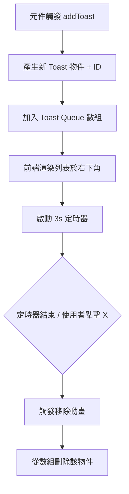

# 提示訊息系統設計思路 (Notification System)

提供輕量化、非侵入式的即時回饋。

## 1. 觸發機制 (Trigger)
- **AI 完成時：** 提報「生成已完成」。
- **發生錯誤時：** 提報詳細錯誤訊息。
- **系統事件：** 如設置存檔設置成功等。

## 2. 視覺表現 (Visuals)
- **位置：** 畫面右下角 (Bottom-Right)。
- **樣式：** 小巧黑框，帶有微透明背景與細白邊邊框。
- **內容：**
    - 圖示 (Success/Error/Warning)
    - 文字內容
    - 關閉按鈕 (X)
- **動畫：** 向上滑入 (Slide-up) 與滑出 (Slide-out)。

## 3. 技術實現邏輯 (Technical Logic)

### A. 全域通知狀態 (Global Event Bus)
- **知識點：** React Context API / Custom Hooks、Array Management (Queue)。
- **實現細節：**
    1. 建立 `ToastContext` 並封裝一個 `addToast(type, message)` 方法。
    2. 主程式 `App.jsx` 包裹此 Provider，使所有元件皆能觸發通知。
    3. 通知存儲在一個數組中，每則通知擁有唯一的 `id` (使用 `Date.now()`)。

### B. 自動清理機制 (Auto-Dismiss)
- **知識點：** `setTimeout`、`useEffect` Cleanup。
- **實現細節：**
    1. `ToastItem` 元件掛載時啟動 3 秒計時器。
    2. 結束後觸發 `removeToast`，從數組中移除該 id。

## 4. 通知管理流程圖



## 5. 實作參考代碼 (Implementation Snippets)

### A. 通知介面元件 (ToastItem.jsx)
```jsx
const ToastItem = ({ id, message, type, onClose }) => {
  useEffect(() => {
    const timer = setTimeout(() => onClose(id), 3000);
    return () => clearTimeout(timer);
  }, []);

  return (
    <div className={`toast-item ${type} slide-in`}>
      <Icon type={type} />
      <span>{message}</span>
      <button onClick={() => onClose(id)}>×</button>
    </div>
  );
};
```

### B. 功能 Hook (useToast.js)
```javascript
export const useToast = () => {
  const { addToast } = useContext(ToastContext);
  
  const notifyAIComplete = () => addToast('success', 'AI 訊息輸出完成');
  const notifyError = (err) => addToast('error', `錯誤: ${err}`);
  
  return { notifyAIComplete, notifyError };
};
```

### C. 關鍵 CSS 動畫
```css
.toast-container {
  position: fixed;
  right: 20px;
  bottom: 20px;
  display: flex;
  flex-direction: column-reverse;
  gap: 10px;
}

@keyframes slideIn {
  from { transform: translateX(120%); }
  to { transform: translateX(0); }
}

.slide-in {
  animation: slideIn 0.3s ease-out;
}
```
