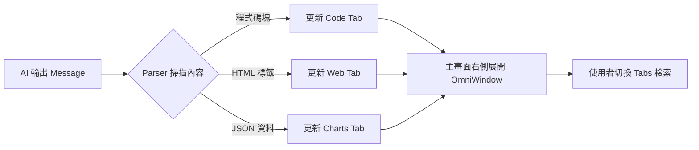

# 萬用視窗設計思路 (Omni-Window Design)

為了解決 AI 輸出內容單一化的問題，我們將引入「萬用視窗」(Omni-Window)，讓 AI 的能力具象化。

## 1. 視窗列表 (Window Tabs)
- 頂部參考 VSCode 設計一排橫向標籤：
    - [x] Code (程式碼檢視)
    - [ ] Webview (網頁瀏覽器)
    - [ ] Charts (圖表數據)
- 點擊標籤可即時切換內容。

## 2. 內容呈現能力 (Capabilities)
- **Code：** 整合代碼高亮 (Syntax Highlighting) 與複製功能。
- **Web：** 使用 `iframe` 或 React 元件渲染 AI 產出的 HTML/CSS 程式碼。
- **Charts：** 支援常用圖表元件（如 Recharts），將資料視覺化。

## 3. 技術實現邏輯 (Technical Logic)

### A. 智能偵測與路由 (Detection & Routing)
- **知識點：** 正則表達式 (Regex Mapping)、Markdown Parsing、Dynamic Component Rendering。
- **實現細節：**
    1. 後端串流傳回 Message 時，前端 Parser 掃描特定標籤（例如 \`\`\`html）。
    2. 若偵測到結構化內容，全域狀態 `omniState` 會更新對應標籤內容，並將該標籤設為「高亮」提示。
    3. 使用者點擊標籤時，透過 `switch-case` 渲染對應的 Renderer 元件。

### B. 內容隔離 (Content Isolation)
- **知識點：** HTML5 `iframe` Sandbox, CSS Scoping。
- **實現細節：**
    1. 為了安全性，Web 模式預覽會放置在一個沙盒化的 `iframe` 中，防止 AI 生成的腳本影響主程序。

## 4. 資料處理流程圖



## 5. 實作參考代碼 (Implementation Snippets)

### A. 視窗容器與標籤切換
```jsx
const OmniWindow = ({ content, type }) => {
  const [activeTab, setActiveTab] = useState(type || 'code');

  return (
    <div className="omni-window">
      <div className="tabs-header">
        <button onClick={() => setActiveTab('code')} className={activeTab === 'code' ? 'active' : ''}>Code</button>
        <button onClick={() => setActiveTab('web')} className={activeTab === 'web' ? 'active' : ''}>Web Preview</button>
        <button onClick={() => setActiveTab('charts')} className={activeTab === 'charts' ? 'active' : ''}>Charts</button>
      </div>
      <div className="content-renderer">
        {activeTab === 'code' && <SyntaxHighlighter code={content} />}
        {activeTab === 'web' && <iframe srcDoc={content} sandbox="allow-scripts" />}
        {activeTab === 'charts' && <DataChart data={content} />}
      </div>
    </div>
  );
};
```

### B. 正則表達式內容擷取邏輯
```javascript
const parseOmniContent = (fullText) => {
  const codeRegex = /```(\w+)\n([\s\S]*?)```/g;
  let match;
  const components = [];
  
  while ((match = codeRegex.exec(fullText)) !== null) {
    components.push({
      type: match[1] === 'html' ? 'web' : 'code',
      content: match[2]
    });
  }
  return components;
};
```

### C. CSS 佈局
```css
.omni-window {
  border-left: 1px solid var(--border-color);
  background: #1e1e1e;
  display: flex;
  flex-direction: column;
}

.tabs-header {
  display: flex;
  background: #252526;
  padding: 0 10px;
}
```
