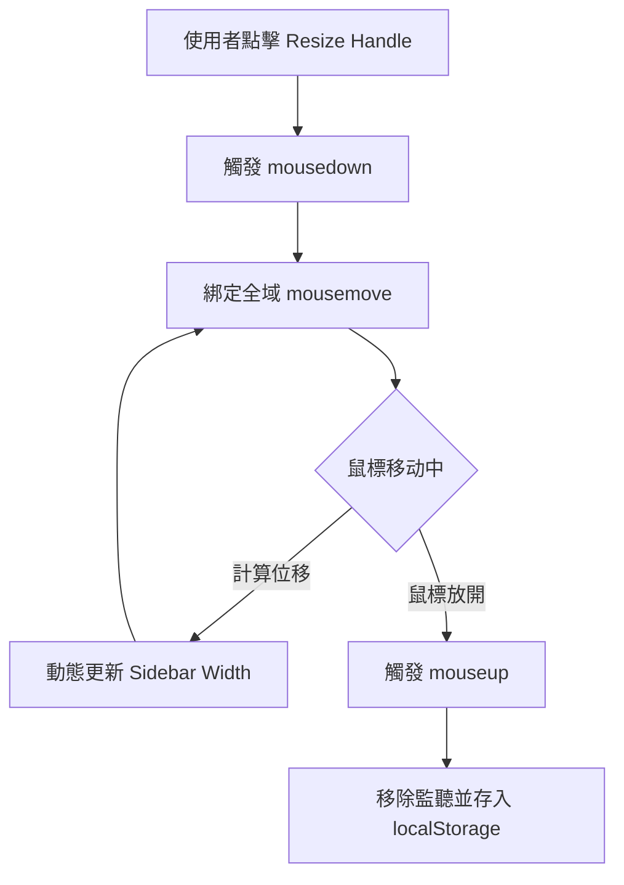

# UI 重構設計思路 (UI Redesign Design)

為了提升使用者體驗與畫面的專業感，本次重構將聚焦於「佈局優化」與「互動細節」。

## 1. 核心佈局架構 (Layout Architecture)
目前的側邊欄混雜了導航與聊天列表。我們將其拆分為兩層：
- **第一層：全域導航列 (Global Navigation Bar)**
    - 位於最左側，寬度固定（約 60px）。
    - 僅包含大圖示：Home, Chat, Settings。
    - 底部放置「帳號系統」入口。
- **第二層：可調式側邊欄 (Resizable Sidebar)**
    - 展示當前選定功能（如 Chat）的詳細內容（如歷史紀錄）。
    - **亮點：** 邊框為一條細微的「互動線條」，使用者可滑動拉長或縮短。
- **第三層：主工作區 (Main Viewport)**
    - 展示當前頁面核心內容（Home, Chat, Settings）。

## 2. 視覺風格 (Visual Style)
- **色調：** 延續深色模式，使用 `surface` 與 `background` 層次感設計。
- **透明度：** 關鍵組件（如 Sidebar）使用玻璃擬態 (Glassmorphism) 效果。
- **間距：** 增加內距 (Padding) 與邊距 (Margin)，讓畫面呼吸感更足。

## 3. 技術實現邏輯 (Technical Logic)

### A. 側邊欄縮放 (Sidebar Resizing)
- **知識點：** 瀏覽器事件監聽 (Event Listeners)、DOM 屬性操作、CSS Flexbox/Grid。
- **實現細節：**
    1. 在 Sidebar 右邊界放置一個隱形的 `resize-handle`Div（寬約 5px）。
    2. 點擊 handle 時觸發 `mousedown`，記錄初始 X 座標。
    3. 監聽全域 `mousemove`，計算位移量並即時更新 Sidebar 的 `width` 變數。
    4. 鬆開滑鼠時移除監聽，並將最終寬度持久化到 `localStorage`。

### B. 導航切換 (Navigation Flux)
- **知識點：** React State Management (useState)、CSS Transitions/Animations。
- **實現細節：**
    1. `App.jsx` 維護 `activeView` 狀態。
    2. Navbar 點擊後傳遞圖示 ID 給 `App.jsx`。
    3. 使用 `AnimatePresence` (或 CSS Animation) 進行視窗淡入淡出切換。

## 4. 互動流程圖 (Interactive Flow)



## 5. 實作參考代碼 (Implementation Snippets)

### A. 全域佈局組件 (Navbar.jsx)
```jsx
const Navbar = ({ onNavigate, activeView }) => {
  return (
    <nav className="global-navbar">
      <div className="nav-items">
        <button onClick={() => onNavigate('home')} className={activeView === 'home' ? 'active' : ''}>
          <HomeIcon />
        </button>
        <button onClick={() => onNavigate('chat')} className={activeView === 'chat' ? 'active' : ''}>
          <ChatIcon />
        </button>
        <button onClick={() => onNavigate('settings')} className={activeView === 'settings' ? 'active' : ''}>
          <SettingsIcon />
        </button>
      </div>
      <div className="nav-footer">
        <button onClick={onOpenAccount} className="account-trigger">
          
        </button>
      </div>
    </nav>
  );
};
```

### B. 縮放邏輯 (Resizable Container)
```javascript
const handleMouseDown = (e) => {
  const startX = e.clientX;
  const startWidth = sidebarWidth;

  const onMouseMove = (moveEvent) => {
    const newWidth = startWidth + (moveEvent.clientX - startX);
    if (newWidth > 150 && newWidth < 500) {
      setSidebarWidth(newWidth);
    }
  };

  const onMouseUp = () => {
    document.removeEventListener('mousemove', onMouseMove);
    document.removeEventListener('mouseup', onMouseUp);
  };

  document.addEventListener('mousemove', onMouseMove);
  document.addEventListener('mouseup', onMouseUp);
};
```

### C. 關鍵 CSS 樣式
```css
.app-layout {
  display: flex;
  height: 100vh;
  background: var(--bg-dark);
}

.resize-handle {
  width: 4px;
  cursor: col-resize;
  background: transparent;
  transition: background 0.2s;
}

.resize-handle:hover {
  background: var(--accent-blue);
}
```
